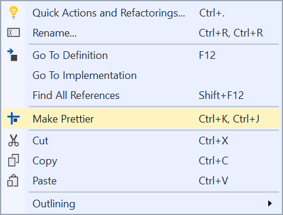

# JavaScript Prettier

[](https://ci.appveyor.com/project/madskristensen/javascriptprettier)

Download this extension from the [Marketplace](https://marketplace.visualstudio.com/items?itemName=MadsKristensen.JavaScriptPrettier)
or get the [CI build](http://vsixgallery.com/extension/J1da7ad9e-85b3-4a0c-8e45-b2ae59a575a7/).

---------------------------------------

Prettier is an opinionated JavaScript formatter inspired by refmt with advanced support for language features from ES2017, JSX, TypeScript and Flow. It removes all original styling and ensures that all outputted JavaScript conforms to a consistent style.

See the [change log](CHANGELOG.md) for changes and road map.

## Features

- Prettifies JavaScript or TypeScript files
- Uses [prettier](https://github.com/jlongster/prettier) node module (uses local version or falls back to plugin version)
- Reads the standard [prettier configuration file](https://prettier.io/docs/en/configuration.html)

### Prettify
This extension calls the [prettier](https://github.com/jlongster/prettier) node module behind the scenes to format any JavaScript document to its standards.

For example, take the following code:

```js
foo(arg1, arg2, arg3, arg4);
```

That looks like the right way to format it. However, we've all run
into this situation:

```js
foo(reallyLongArg(), omgSoManyParameters(), IShouldRefactorThis(), isThereSeriouslyAnotherOne());
```

Suddenly our previous format for calling function breaks down because
this is too long. What you would probably do is this instead:

```js
foo(
  reallyLongArg(),
  omgSoManyParameters(),
  IShouldRefactorThis(),
  isThereSeriouslyAnotherOne()
);
```

Invoke the command from the context menu in the JavaScript editor.



### FAQ

#### Updating from 1.1 to 2.0
Depending on your Visual Studio Configuration, you might experience that 2.0's output differs from the one you got with 1.1.  
Most likely it is the tab size that has been changed from 4 spaces to 2. Please read the configuration section below on details how to get 4 spaces as tabsize.

#### Configuration
It is quite easy to setup Prettier to format alittle bit different. Like having 4 spaces instead of 2 spaces. The easiest way is to create a `.prettierrc` in your project root. Here is an example containing the two most common settings that people want to change: `tabWidth` is how many spaces it uses for indentation, and `printWidth` is how long a line can be before it breaks down:

```json
  {
    "tabWidth": 4,
    "printWidth": 100
  }
```

[Read more about the configuration file here](https://prettier.io/docs/en/configuration.html)

#### Can it use my bundled version of prettier?
Yes, the plugin will search for a locally installed prettier version before falling back to its own version.

## Contribute
Check out the [contribution guidelines](.github/CONTRIBUTING.md)
if you want to contribute to this project.

For cloning and building this project yourself, make sure
to install the
[Extensibility Tools 2015](https://visualstudiogallery.msdn.microsoft.com/ab39a092-1343-46e2-b0f1-6a3f91155aa6)
extension for Visual Studio which enables some features
used by this project.

## License
[Apache 2.0](LICENSE)
